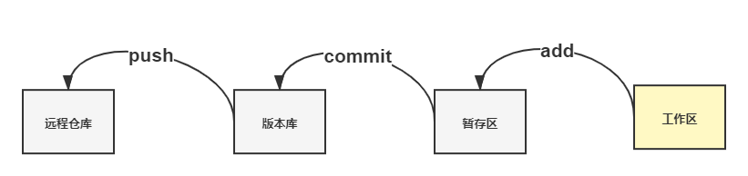

# git 代码管理

---

[toc]

## 概述

> Git 本地数据管理，大概可以分为三个区，工作区，暂存区和版本库。

- **工作区（Working Directory）**
即我们创建的工程文件， 在编辑器可直观显示；

- **暂存区（Stage 或 Index）**
数据暂时存放的区域，可在工作区和版本库之间进行数据的友好交流。

- **版本库/本地库（Commit History）**
存放已经提交的数据，`push` 的时候，将这个区的数据 `push` 到**远程仓库**。

## 比较命令

|命令|作用|说明|
|---|---|---|
|`git diff` |工作区 vs 暂存区|运行`git add`提交更改|
|`git diff head` |工作区 vs 版本库|运行`git commit -a`提交更改|
|`git diff --cached` |暂存区 vs 版本库|运行`git commit`提交更改|

## 撤销命令

### 撤销 `add` 操作

```bash
git reset HEAD <filename>
```

### 撤销 `commit` 操作

|命令|作用|说明|
|---|---|说明|
|`git reset --mixed` |版本库->工作区|默认方式，从版本库回滚到工作区。保留工作区修改内容，并清空暂存区内容|
|`git reset --soft` |版本库->暂存区|从版本库回滚到暂存区|
|`git reset --hard` |版本库->工作区|从版本库回滚到工作区。不保留工作区内容，并清空暂存区内容|

### 插销 `push` 操作

```bash
git revert <commit-id>
```

### `reset` 与 `revert` 区别

- `reset`，实质上是将`HEAD`的指向移动了位置，即舍弃了提交历史。
- `revert`，是一次新的提交，`HEAD`会继续向前执行。

## 提交命令



|命令|作用|
|---|---|
|`git add`|工作区->暂存区|
|`git commit`|暂存区->版本库|
|`git push`|版本库->远程库|

## 拉取命令

|命令|作用|说明
|---|---|---|
|`git clone`|远程库->版本库->工作区|将远程库代码拉取到版本库、工作区，并与其同步。|
|`git pull`|远程库->版本库->工作区|将远程库代码拉取到版本库，并合并到工作区。等同于：</br>`git fetch`</br>`git merge`|
|`git fetch`|远程库->版本库|将远程代码拉取到版本库。|
|`git merge`|版本库->工作区|将版本库代码合并到工作区。|

## 冲突解决

> 工作区与远程库冲突。

1. 放弃本地修改

    ```bash
    # 版本库覆盖工作区
    git checkout head .
    # 更新远程库
    git pull
    ```

1. 解决冲突后，提交本地修改

    ```bash
    # 将本地修改缓存
    git stash
    # 拉取远程库代码
    git pull
    # 从缓存取出本地修改
    git stash pop
    # 手工解决冲突后提交代码
    git commit -am "解决冲突！"
    git push origin master
    ```
