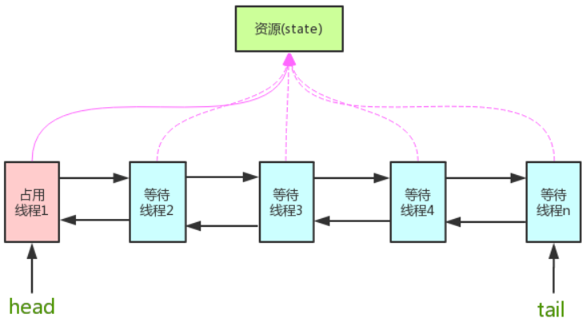

# java AQS介绍

---

[toc]

## 概述

> AQS（AbstractQueuedSynchronizer），是并发容器`J.U.C`下`locks`包内的一个抽象类。
> 底层数据结构是一个**双向链表**，实现了**FIFO**的队列。

## 框架

> `J.U.C` 包是在AQS的基础上搭建起来的，AQS提供了一种实现阻塞锁和一系列依赖FIFO等待队列的同步器的框架。



### 核心思想

> 如果被请求的共享资源空闲，则将当前请求资源的线程设置为有效的工作线程，并且将共享资源设置为锁定状态。
> 如果被请求的共享资源被占用，那么就需要一套线程阻塞等待以及被唤醒时锁分配的机制。AQS 使用`CLH`同步队列（FIFO双向队列）实现该机制，即将暂时获取不到锁的线程加入到队列中。

### 设计思想

- 使用`Node`实现FIFO队列，可以用于构建锁或者其他同步装置的基础框架。
- 利用`int`类型标识状态（AQS成员变量`state`）。例如，`ReentrantLock`中`stste`表示获取锁的线程数：
  - `state=0`，表示还没有线程获取锁。
  - `state=1`表示有线程获取了锁。
  - `state>1`表示重入锁的数量。
- 继承，子类通过继承并通过实现它的方法管理其状态（`acquire`和`release`方法）。
- 主要功能为**独占**和**共享**。

### 实现思路

> AQS内部维护了一个CLH队列来管理锁。

1. 线程会首先尝试获取锁。如果失败就将当前线程及等待状态等信息包装成一个`node`节点加入到同步队列里。
1. 如果当前节点为`head`的直接后继，会不断的循环尝试获取锁，失败则会阻塞自己直到自己被唤醒。
1. 当持有锁的线程释放锁的时候，会唤醒队列中的后继线程。

## 源码

### 节点状态

> Node 节点是对每一个等待获取资源的线程的封装，其包含了需要同步的线程本身及其等待状态。如是否被阻塞、是否等待唤醒、是否已经被取消等。
> AQS 中变量 `waitStatus` 则表示当前Node节点的等待状态。（负值表示节点处于有效等待状态，而正值表示节点已被取消。）

- `0`：新节点入队时的默认状态。
- `CANCELLED`(`1`)：表示当前节点已取消调度。当timeout或被中断（响应中断的情况下），会触发变更为此状态，进入该状态后的节点将不会再变化。
- `SIGNAL`(`-1`)：表示后继节点在等待当前节点唤醒。后继节点入队时，会将前继节点的状态更新为SIGNAL。
- `CONDITION`(`-2`)：表示节点等待在Condition上，当其他线程调用了Condition的signal()方法后，CONDITION状态的节点将从等待队列转移到同步队列中，等待获取同步锁。
- `PROPAGATE`(`-3`)：共享模式下，前继节点不仅会唤醒其后继节点，同时也可能会唤醒后继的后继节点。

### 获取资源方法 `acquire(int)`

> 此方法是独占模式下线程获取共享资源的顶层入口。
> 如果获取到资源，线程直接返回，否则进入等待队列，直到获取到资源为止，且整个过程忽略中断的影响。
> 获取到资源后，线程就可以去执行其临界区代码了。

```java
public final void acquire(int arg) {
    if (!tryAcquire(arg) &&
        acquireQueued(addWaiter(Node.EXCLUSIVE), arg))
        selfInterrupt();
}
```

1. `tryAcquire()`尝试直接去获取资源，如果成功则直接返回（这里体现了非公平锁，每个线程获取锁时会尝试直接抢占加塞一次，而CLH队列中可能还有别的线程在等待）；
1. `addWaiter()`将该线程加入等待队列的尾部，并标记为独占模式；
1. `acquireQueued()`使线程阻塞在等待队列中获取资源，一直获取到资源后才返回。如果在整个等待过程中被中断过，则返回`true`，否则返回`false`。
1. 如果线程在等待过程中被中断过，它是不响应的。只是获取资源后才再进行自我中断`selfInterrupt()`，将中断补上。

### 释放资源方法 `release(int)`

> 此方法是独占模式下线程释放共享资源的顶层入口。
> 它会释放指定量的资源，如果彻底释放了（即`state=0`），它会唤醒等待队列里的其他线程来获取资源。

```java
public final boolean release(int arg) {
    if (tryRelease(arg)) {
        Node h = head;//找到头节点
        if (h != null && h.waitStatus != 0)
            unparkSuccessor(h);//唤醒等待队列里的下一个线程
        return true;
    }
    return false;
}
```

### 共享资源方法 `acquireShared(int)`

> 此方法是共享模式下线程获取共享资源的顶层入口。
> 它会获取指定量的资源，获取成功则直接返回，获取失败则进入等待队列，直到获取到资源为止，整个过程忽略中断。

```java
public final void acquireShared(int arg) {
    if (tryAcquireShared(arg) < 0)
        doAcquireShared(arg);
}
```

### 释放共享资源方法 `releaseShared()`

> 此方法是共享模式下线程释放共享资源的顶层入口。
> 它会释放指定量的资源，如果成功释放且允许唤醒等待线程，它会唤醒等待队列里的其他线程来获取资源。

```java
public final boolean releaseShared(int arg) {
    if (tryReleaseShared(arg)) {//尝试释放资源
        doReleaseShared();//唤醒后继节点
        return true;
    }
    return false;
}
```

## 应用

- `Mutex`
- `ReentrantLock`
- `CountDownLatch`
- `Semphore`
