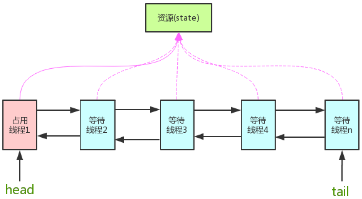

# java CLH同步队列

---

[toc]

## 概述

> CLH同步队列是一个**FIFO**双向队列，AQS依赖它来完成同步状态的管理。
> 当前线程如果获取同步状态失败时，AQS则会将当前线程已经等待状态等信息构造成一个节点（Node）并将其加入到CLH同步队列，同时会阻塞当前线程。
> 当同步状态释放时，会把首节点唤醒（公平锁），使其再次尝试获取同步状态。

## 实现

> 在CLH同步队列中，一个节点表示一个线程。节点包含线程的引用（`thread`）、状态(`waitStatus`)、前驱节点（`prev`）以及后继节点（`next`），定义如下：

```java
static final class Node {
    /** 共享 */
    static final Node SHARED = new Node();
 
    /** 独占 */
    static final Node EXCLUSIVE = null;
 
    /**
     * 因为超时或者中断，节点会被设置为取消状态，被取消的节点时不会参与到竞争中的，他会一直保持取消状态不会转变为其他状态；
     */
    static final int CANCELLED =  1;
 
    /**
     * 后继节点的线程处于等待状态，而当前节点的线程如果释放了同步状态或者被取消，将会通知后继节点，使后继节点的线程得以运行
     */
    static final int SIGNAL    = -1;
 
    /**
     * 节点在等待队列中，节点线程等待在Condition上，当其他线程对Condition调用了signal()后，改节点将会从等待队列中转移到同步队列中，加入到同步状态的获取中
     */
    static final int CONDITION = -2;
 
    /**
     * 表示下一次共享式同步状态获取将会无条件地传播下去
     */
    static final int PROPAGATE = -3;
 
    /** 等待状态 */
    volatile int waitStatus;
 
    /** 前驱节点 */
    volatile Node prev;
 
    /** 后继节点 */
    volatile Node next;
 
    /** 获取同步状态的线程 */
    volatile Thread thread;
 
    Node nextWaiter;
 
    final boolean isShared() {
        return nextWaiter == SHARED;
    }
 
    final Node predecessor() throws NullPointerException {
        Node p = prev;
        if (p == null)
            throw new NullPointerException();
        else
            return p;
    }
 
    Node() {
    }
 
    Node(Thread thread, Node mode) {
        this.nextWaiter = mode;
        this.thread = thread;
    }
 
    Node(Thread thread, int waitStatus) {
        this.waitStatus = waitStatus;
        this.thread = thread;
    }
}
```

### 入列

> `tail` 指向新节点、新节点的 `prev` 指向当前最后的节点，当前最后一个节点的 `next` 指向当前节点。
> 通过CAS方法，确保节点是线程安全添加的。



### 出列

> CLH同步队列遵循FIFO，首节点的线程释放同步状态后，将会唤醒它的后继节点（`next`），而后继节点将会在获取同步状态成功时将自己设置为首节点。
> `head` 执行该节点并断开原首节点的 `next` 和当前节点的 `prev`。


