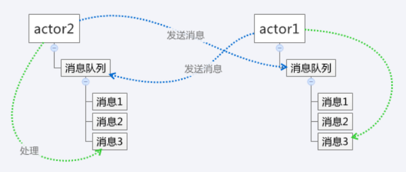

# java 线程通信机制

---

[toc]

## 概述

> 指不同线程对同一资源的操作。主要包含两种方式：**共享内存**、**消息传递**。

### 线程同步

> 指线程之间所具有的⼀种制约关系。⼀个线程的执⾏依赖另⼀个线程的消息，当它没有得到另⼀个线程的消息时应等待，直到消息到达时才被唤醒。

### 线程互斥

> 可看成是特殊的线程同步。
> 指对于共享的系统资源，在各单个线程访问时的排它性。当有若⼲个线程都要使⽤某⼀共享资源时，任何时刻最多只允许⼀个线程去使⽤，其它要使⽤该资源的线程必须等待，直到占⽤资源者释放该资源。

## 共享内存

> 多个线程访问同一个共享变量，拿到了锁（获得了访问权限）的线程可以执行。

### 同步“等待/通知”机制

- 方法
  - `wait()`：阻塞线程。将当前线程状态改为等待状态，加入等待队列，并释放占用锁。
  - `wait(long)`：类似`wait()`方法，增加超时参数。一旦超时，就会继续执行`wait`后面的代码。
  - `notify()`：唤醒线程。将等待队列中的一条线程转移到同步队列中去。
  - `notifyAll()`：将等待队列中的所有的线程都转移到同步队列中去。
- 注意
  - 以上方法必须放在一个同步块 `synchronized` 中。
    > 需要和共享变量配合使用，一般是先检查状态，再执行。因此会对这个过程加一把锁，确保其原子性运行。
  - 以上方法只能够用方法所处同步块的**锁对象**调用。
    > 锁是对象级的⽽不是线程级的，每个对象都有锁，通过线程获得。
  - 锁对象`A.notify()`只能够唤醒`A.wait()`。
  - 调用`notify`/`notifyAll`函数仅仅是将线程从等待队列转移到阻塞队列，只有当线程竞争到资源锁时，才能够从`wait`中返回，继续执行接下来的代码。

### 条件锁 `Condition`

> 可以指定要唤醒的线程，而不是每一个都唤醒。

- `await()`，阻塞线程。
- `signalAll()`，唤醒所有线程。

### 闭锁 `CountDownLatch`

> 用于等待事件，当闭锁到达结束状态之前，所有线程都等待；当闭锁到达结束状态时，所有线程都通过。
> 闭锁是一次性的，当闭锁到达结束状态后，将不会被重置，这个锁会永远打开并允许所有线程通过。

### 栅栏 `CyclicBarrier`

> 用于等待线程，所有线程必须同时到达栅栏，才能继续执行。
> 栅栏不是一次性的，可以被重置。

### 信号量 `Semaphore`

> 用于控制同时访问某个资源的线程数量，信号量还可以用于实现某个资源池。
> 信号量管理者一组虚拟的许可，线程在执行操作时首先要获得许可，如果信号量的许可数量为`0`，那么`accquire`将阻塞直到有许可为止。
> 信号量不是一次性的，当信号链的许可用完之后，可以通过`release`释放许可。

### `join`使用

> 当调用join的线程执行完毕后，其他线程才能执行。

```java
// 线程顺序执行，a线程执行完毕后，b线程才能执行
public static void main(String[] args) {
    Thread a = new Thread(() -> System.out.println("A"));
    Thread b = new Thread(() -> System.out.println("B"));
    try {
        a.start();
        a.join();
        b.start();
    } catch(InterruptedException e){
        e.printStackTrace();
    }
}
```

### `yield`使用

> 当一个线程中调用`Thread.yield()`后，这个线程就会把自己的CPU执行时间让给自己或其它线程。
> `yield`执行后，能让当前线程由**运行状态**进入到**就绪状态**，将自己的CPU时间片让出来。让出来之后有可能是其它线程执行，也有可能是该线程继续执行。

### `sleep`使用

> `Thread.sleep(long)`，不会释放锁。`wait`通常被⽤于线程间交互，`sleep`通常被⽤于**暂停执⾏**。

## 消息传递

> 采取线程之间的直接通信，不同的线程之间通过显式的发送消息来达到交互目的。

### `actor`模型

> 在这种模型下，一切都是`actor`，所有的`actor`之间的通信都必须通过传递消息才能达到。
> 每个`actor`都有一个收件箱(消息队列)用来保存收到其他`actor`传递来的消息。
> `actor`自己也可以给自己发送消息。



### 管道流

> 用于两个线程之间的字符流动或者字节流动。生产者向管道中输出数据，消费者从管道中读取数据。

- `PipedOutputSTream`
- `PipedInputStream`
- `PipedWriter`
- `PipedReader`

存在问题：

1. 管道流只能在两个线程之间传递数据
1. 管道流只能实现单向发送，如果要两个线程之间互通讯，则需要两个管道流
