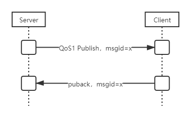
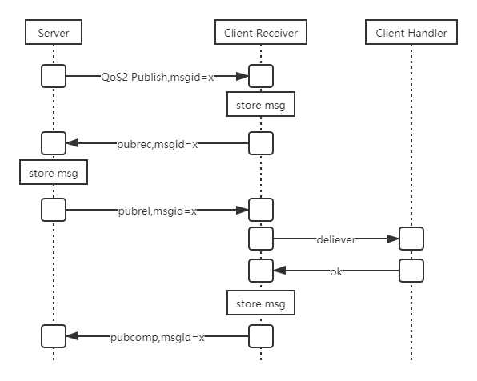

# MQTT QoS 介绍

---

[toc]

## 概述

> MQTT协议的 `publish` 有三个QoS。

- `QoS0`，最多一次送达。也就是发出去就fire掉，没有后面的事情了。
- `QoS1`，至少一次送达。发出去之后必须等待ack，没有ack，就要找时机重发。
- `QoS2`，准确一次送达。消息id将拥有一个简单的生命周期。

## QoS0

## QoS1

- 如果 `publish` 下发出现问题，将没有 `puback` 回复，服务器将找机会重新下发该 `msgid` 的消息。
- 如果 `ack` 回复出现问题，服务器认为没有收到确认，仍然重新找机会重新下发该 `msgid` 的消息。
- 客户端会收重复收到该 `msgid` 的消息，需自行去重。与QoS1的至少一次送达没有矛盾。

## QoS2

- `publish` 下发失败了，服务器重发 `publish`。
- `pubrec` 上报失败了，服务器重发 `publish`。这个时候，客户端仍然是重复收到多次 `publish`。
- `pubrel` 下发失败了，服务器重发 `pubrel`。
- `pubcomp` 上报失败了，服务器重发 `pubrel`。
