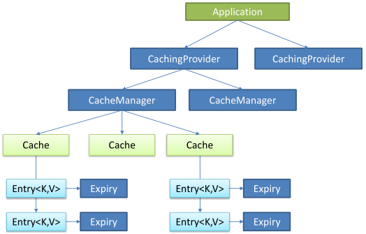

# springboot 使用缓存

---

[toc]

## 概述

> 使用`Cache`、`CacheManager`接口来统一不同的缓存技术，并使用`Java Caching`（`JSR-107`）注解简化缓存开发。

### spring 抽象缓存

1. 定义
    > 将缓存处理和缓存技术解除耦合。
    > `Spring Cache` 只负责维护抽象层，具体的实现由技术选型决定。

1. 重要接口
    - `org.springframework.cache.Cache`：缓存抽象的规范接口，缓存实现有：`RedisCache`、`EhCacheCache`、`ConcurrentMapCache`等
    - `org.springframework.cache.CacheManager`：缓存管理器，管理`Cache`的生命周期

### `JSR-107`

1. 核心接口
    - `CachingProvider`：创建、配置、获取、管理和控制多个 `CacheManager`
    - `CacheManager`：创建、配置、获取、管理和控制多个唯一命名的`Cache`，`Cache`存在于`CacheManager`的上下文中。一个`CacheManager`仅对应一个`CachingProvider`
    - `Cache`：是由`CacheManager`管理的，`CacheManager`管理`Cache`的生命周期，`Cache`存在于CacheManager的上下文中，是一个类似`map`的数据结构，并临时存储以`key`为索引的值。一个`Cache`仅被一个`CacheManager`所拥有
    - `Entry`：是一个存储在`Cache中`的`key-value`对
    - `Expiry`：每一个存储在`Cache`中的条目都有一个定义的有效期。一旦超过这个时间，条目就自动过期，过期后，条目将不可以访问、更新和删除操作。缓存有效期可以通过`ExpiryPolicy`设置

1. 图示


## spring 使用缓存

- `@Cacheable`：针对方法配置，能够根据方法的请求参数对其结果进行缓存
- `@CacheEvict`：清空缓存
- `@CachePut`：既调用方法，又更新缓存数据
- `@EnableCaching`：开启基于注解的缓存
- `@Caching`：定义复杂的缓存规则

### 添加`pom`依赖

```pom
<dependency>
    <groupId>org.springframework.boot</groupId>
    <artifactId>spring-boot-starter-cache</artifactId>
</dependency>
```

### `@EnableCaching`

> 开启基于注解的缓存。

```java
@SpringBootApplication
@EnableCaching
public class SpringbootCacheApplication {

    public static void main(String[] args) {
        SpringApplication.run(SpringbootCacheApplication.class, args);
    }
}
```

### `@Cacheable`

> 主要是针对方法配置，能够根据方法的请求参数对其结果进行缓存，介绍一下注解的主要属性。

- `cacheNames/value`：指定缓存组件的名字，数组形式
- `key`：缓存数据使用的key，确定缓存可以用唯一key进行指定；eg：编写SpEL； #id，参数id的值 ,，#a0(第一个参数)， #p0(和a0的一样的意义) ，#root.args[0]
- `keyGenerator`：key的生成器；可以自己指定key的生成器的组件id（注意： `key`/`keyGenerator`不能同时使用）
- `cacheManager`：指定缓存管理器；或者`cacheResolver`指定获取解析器
- `condition`：指定符合条件的情况下才缓存；使用SpEl表达式，eg：condition = "#a0>1"：第一个参数的值>1的时候才进行缓存
- `unless`:否定缓存；当`unless`指定的条件为`true`，方法的返回值就不会被缓存；eg：unless = "#a0！=2":如果第一个参数的值不是2，结果不缓存；
- `sync`：是否使用异步模式

```java
// 也可以使用自定义的 keyGenerator
@Cacheable(value = {"emp"}, /*keyGenerator = "myKeyGenerator",*/key = "#id",condition = "#a0>=1",unless = "#a0!=2")
public Employee getEmp(Integer id) {
    Employee employee = this.employeeMapper.getEmpById(id);
    LOG.info("查询{}号员工数据",id);

    return employee;
}
```

```java
// 定义KeyGenerator添加到Spring容器
@Configuration
public class CacheConfig {

    @Bean(value = {"myKeyGenerator"})
    public KeyGenerator keyGenerator(){
        return new KeyGenerator() {
            @Override
            public Object generate(Object target, Method method, Object... params) {
                return method.getName()+"["+ Arrays.asList(params).toString()+"]";
            }
        };
    }
}
```

### `@CachePut`

> 既调用方法，又更新缓存数据。

```java
@CachePut(value = {"emp"}, key = "#result.id")
public Employee updateEmp(Employee employee){
    employeeMapper.updateEmp(employee);
    LOG.info("更新{}号员工数据",employee.getId());
    return employee;
}
```

### `@CacheEvic`

主要属性：

- `key`：指定要清除的数据
- `allEntries = true`：指定清除这个缓存中所有的数据
- `beforeInvocation = false`：默认代表缓存清除操作是在方法执行之后执行
- `beforeInvocation = true`：代表清除缓存操作是在方法运行之前执行

```java
@CacheEvict(value = {"emp"}, beforeInvocation = true,key="#id")
public void deleteEmp(Integer id){
    employeeMapper.deleteEmpById(id);
}
```

### `@Caching`

> 定义复杂的缓存规则，可以集成 `@Cacheable`和 `@CachePut`。

```java
 // @Caching 定义复杂的缓存规则
@Caching(
    cacheable = {
            @Cacheable(/*value={"emp"},*/key = "#lastName")
    },
    put = {
            @CachePut(/*value={"emp"},*/key = "#result.id"),
            @CachePut(/*value={"emp"},*/key = "#result.email")
    }
)
public Employee getEmpByLastName(String lastName){
    return employeeMapper.getEmpByLastName(lastName);
}
```

### `@CacheConfig`

> 用于抽取缓存的公共配置。示例， `@CacheConfig(cacheNames = {"emp"},cacheManager = "employeeCacheManager")`

|名称| 位置| 描述| 示例|
|---|---|---|---|
|`methodName`   |root对象| 当前被调用的方法名|`#root.method.name`
|`method`       |root对象| 当前被调用的方法|`#root.method.name`
|`target`       |root对象| 当前被调用的目标对象实例|`#root.target`
|`targetClass`  |root对象| 当前被调用的目标对象的类|`#root.targetClass`
|`args`         |root对象| 当前被调用的方法的参数列表|`#root.args[0]`
|`caches`       |root对象| 当前方法调用使用的缓存列表|`#root.caches[0].name`
|`argument Name`|执行上下文(`avaluation context`)| 当前被调用的方法的参数|`#artsian.id`
|`result`       |执行上下文(`evaluation context`)| 方法执行后的返回值|`#result`

## 集成Redis缓存

### 添加pom依赖

```pom
<dependency>
    <groupId>org.springframework.boot</groupId>
    <artifactId>spring-boot-starter-data-redis</artifactId>
</dependency>
<dependency>
    <groupId>org.apache.commons</groupId>
    <artifactId>commons-pool2</artifactId>
</dependency>
```

### 修改配置文件

`spring.cache.type=redis`

### 配置类实现

```java
@Resource
private LettuceConnectionFactory lettuceConnectionFactory;

@Bean
@Primary
public RedisTemplate<Object,Object> redisTemplate(){
    RedisTemplate<Object,Object> redisTemplate = new RedisTemplate<Object, Object>();
    redisTemplate.setConnectionFactory(lettuceConnectionFactory);
    Jackson2JsonRedisSerializer<Object> jackson2JsonRedisSerializer = this.initJacksonSerializer();
    // 设置value的序列化规则和 key的序列化规则
    redisTemplate.setValueSerializer(jackson2JsonRedisSerializer);
    redisTemplate.setKeySerializer(new StringRedisSerializer());
    redisTemplate.afterPropertiesSet();
    return redisTemplate;
}
```

### RestTemplate相关操作

```java
redisTemplate.opsForValue();    //操作字符串
redisTemplate.opsForHash();     //操作hash
redisTemplate.opsForList();     //操作list
redisTemplate.opsForSet();      //操作set
redisTemplate.opsForZSet();     //操作有序set
```

### 缓存业务测试

```java
@Autowired
DepartmentMapper departmentMapper;

@Qualifier("redisCacheManager")
@Autowired
RedisCacheManager redisCacheManager;

// 使用缓存管理器得到缓存，进行api调用
public Department getDeptById(Integer id){
    LOG.info("查询id为{}的员工信息",id);

    //获取某个缓存
    Cache deptCache = redisCacheManager.getCache("dept");
    Department department = null;
    if(deptCache.get(id)==null){
        department = departmentMapper.getDeptById(id);
        deptCache.put(id,department);
    } else {
        SimpleValueWrapper valueWrapper = (SimpleValueWrapper) deptCache.get(id);
        department = (Department)valueWrapper.get();
    }

    return department;
}
```
