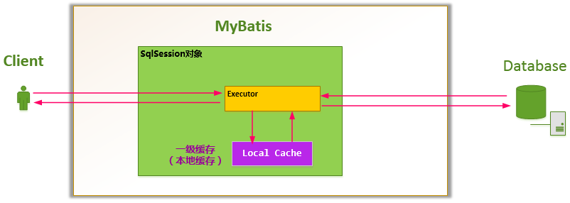
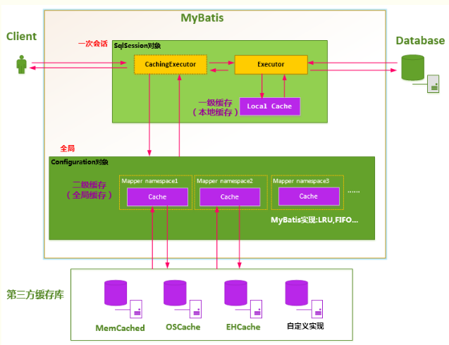

# MyBatis 缓存使用

---

[toc]

## 概述

> 使用缓存，可以避免频繁的与数据库进行交互， 尤其是在查询越多、缓存命中率越高的情况下， 使用缓存对性能的提高更明显。
> MyBatis 提供了对缓存的支持，分为**一级缓存**与**二级缓存**。默认情况下，只开启一级缓存。

### 查询数据顺序

> 如果开启了二级缓存，则查询顺序是 **二级缓存 —> 一级缓 > 数据库**。

### 顶级接口 `Cache`

```java
public interface Cache {

  /**
   * @return The identifier of this cache
   */
  String getId();

  /**
   * @param key
   *          Can be any object but usually it is a {@link CacheKey}
   * @param value
   *          The result of a select.
   */
  void putObject(Object key, Object value);

  /**
   * @param key
   *          The key
   * @return The object stored in the cache.
   */
  Object getObject(Object key);

  /**
   * As of 3.3.0 this method is only called during a rollback
   * for any previous value that was missing in the cache.
   * This lets any blocking cache to release the lock that
   * may have previously put on the key.
   * A blocking cache puts a lock when a value is null
   * and releases it when the value is back again.
   * This way other threads will wait for the value to be
   * available instead of hitting the database.
   *
   *
   * @param key
   *          The key
   * @return Not used
   */
  Object removeObject(Object key);

  /**
   * Clears this cache instance.
   */
  void clear();

  /**
   * Optional. This method is not called by the core.
   *
   * @return The number of elements stored in the cache (not its capacity).
   */
  int getSize();

  /**
   * Optional. As of 3.2.6 this method is no longer called by the core.
   * <p>
   * Any locking needed by the cache must be provided internally by the cache provider.
   *
   * @return A ReadWriteLock
   */
  default ReadWriteLock getReadWriteLock() {
    return null;
  }
}
```

### 实现类 `PerpetualCache`

> 内部维护了一个 `HashMap` 来实现缓存。

```java
public class PerpetualCache implements Cache {

  private final String id;

  private final Map<Object, Object> cache = new HashMap<>();

  public PerpetualCache(String id) {
    this.id = id;
  }

  @Override
  public String getId() {
    return id;
  }

  @Override
  public int getSize() {
    return cache.size();
  }

  @Override
  public void putObject(Object key, Object value) {
    cache.put(key, value);
  }

  @Override
  public Object getObject(Object key) {
    return cache.get(key);
  }

  @Override
  public Object removeObject(Object key) {
    return cache.remove(key);
  }

  @Override
  public void clear() {
    cache.clear();
  }

  @Override
  public boolean equals(Object o) {
    if (getId() == null) {
      throw new CacheException("Cache instances require an ID.");
    }
    if (this == o) {
      return true;
    }
    if (!(o instanceof Cache)) {
      return false;
    }

    Cache otherCache = (Cache) o;
    return getId().equals(otherCache.getId());
  }

  @Override
  public int hashCode() {
    if (getId() == null) {
      throw new CacheException("Cache instances require an ID.");
    }
    return getId().hashCode();
  }
}
```

### 缓存分类

> 缓存实现类总体上可分为三类：基本缓存、淘汰算法缓存、装饰器缓存。
> 通过装饰器缓存可以额外实现很多的功能，回收策略、日志记录、定时刷新等。但是无论怎么装饰，经过多少层装饰，最后使用的还是基本的实现类（默认`PerpetualCache`）。

|缓存实现类|描述|作用|装饰条件|
|---|---|---|---|
|基本缓存|缓存基本实现类|默认`PerpetualCache`。可自定义，如`RedisCache`、`EhCache`等具备基本功能的缓存类|无|
||||
|`LruCache`|LRU（Least Recently Use）策略的缓存|当缓存达到上限，删除最少使用的缓存|`eviction = "LRU"`（默认）|
|`FifoCache`|FIFO 策略的缓存|当缓存达到上限，删除最先入队的缓存|`eviction = "FIFO"`|
|`SoftCache/WeakCache`|带清理策略的缓存|通过JVM的软引用（`SoftReference`）和弱引用（`WeakReference`）来实现缓存。当JVM内存不足时，会自动清理缓存。|`eviction = "SOFT"`</br>`eviction = "WEAK"`
||||
|`LoggingCache`|带日志功能的缓存|比如，输出缓存命中率|基本|
|`SynchronizedCache`|同步缓存|基于`synchronized`关键字实现，解决并发问题|基本|
|`BlockingCache`|阻塞缓存|基于java重入，通过在`get`/`put`方法中加锁，保证只有一个线程操作缓存。|`blocking=true`|
|`SerializedCache`|支持序列化的缓存|将对象序列化以后存到缓存中，取出时反序列化|`readOnly=false`（默认）|
|`ScheduledCache`|定时调度的缓存|在进行`get`/`put`/`remove`/`getSize`等操作前，判断缓存时间是否超过了设置的最长缓存时间（默认1h）。如果是，则清空缓存。即每隔一段时间清空一次缓存|`flushInterval`不为中用`Map`维护对应关系|

## 一级缓存

> 也称**本地缓存（Local Cache）**。同一个 `SqlSession` 对象， 在参数和 `SQL` 完全一样的情况下， 只执行一次 `SQL` 语句（如果缓存没有过期）。



1. 对于某个查询，根据`statementId`、`params`、`rowBounds`来构建一个`key`值，根据这个`key`值去缓存`Cache`中取出对应的`key`值存储的缓存结果​。
1. 判断从`Cache`中根据特定的`key`值取的数据数据是否为空，即是否命中；​
1. 如果命中，则直接将缓存结果返回；​
1. 如果没命中：
    1. 去数据库中查询数据，得到查询结果；
    1. 将`key`和查询到的结果作为`Key-Value`存储到`Cache`中；
    1. 将查询结果返回；

### 缓存周期

1. MyBatis在开启一个数据库会话时，会创建一个新的 `SqlSession` 对象，`SqlSession` 对象中会有一个新的 `Executor` 对象。`Executor` 对象中持有一个新的 `PerpetualCache` 对象；当会话结束时，`SqlSession` 对象及其内部的 `Executor` 对象还有 `PerpetualCache` 对象也一并释放掉。
1. 如果 `SqlSession` 调用了 `close()` 方法，会释放掉一级缓存 `PerpetualCache` 对象，一级缓存将不可用。
1. 如果 `SqlSession` 调用了 `clearCache()`，会清空 `PerpetualCache` 对象中的数据，但是该对象仍可使用。
1. `SqlSession` 中执行了任何一个 `update` 操作(`update()`、`delete()`、`insert()`) ，都会清空 `PerpetualCache` 对象的数据，但是该对象可以继续使用。

### 完全相同查询

> Mybatis 对于两次查询，如果以下条件都完全一样，那么就认为是完全相同的两次查询。

1. 传入的 `statementId`
1. 查询时要求的结果集中的结果范围
1. 本次查询最终要传递给`java.sql.Preparedstatement`的Sql语句字符串 `boundSql.getSql()`
1. 传递给`java.sql.Statement`要设置的参数值

### 一级缓存不足

> 使用一级缓存的时候，因为缓存不能跨会话共享，不同的会话之间对于相同的数据可能有不一样的缓存。
> 在有多个会话或者分布式环境下，会存在脏数据的问题。如果要解决这个问题，就要用到二级缓存。

一级缓存无法关闭，但可配置级别：

- `session` 级别的缓存。在同一个 `sqlSession` 内，对同样的查询将不再查询数据库，直接从缓存中。
- `statement` 级别的缓存。为了避免上面问题，可以将一级缓存的级别设为 `statement` 级别，这样每次查询结束都会清掉一级缓存。

## 二级缓存

> 存在于 `SqlSessionFactory` 生命周期中，是 `Application` 级别的缓存，可以提高对数据库查询的效率，以提高应用的性能。
> `SqlSessionFactory` 层面上的二级缓存默认是不开启的。实现二级缓存时，MyBatis要求返回的POJO必须是**可序列化**的。



### 配置二级缓存作用

- 映射语句文件中的所有 `select` 语句将会被缓存。
- 映射语句文件中的所有 `insert`、`update`和`delete`语句会刷新缓存。
- 缓存会使用默认的 `Least Recently Used`（`LRU`，最近最少使用的）算法来收回。
- 根据时间表刷新缓存。比如，`No Flush Interval`（`CNFI`没有刷新间隔），缓存不会以任何时间顺序来刷新。
- 缓存会存储列表集合或对象(无论查询方法返回什么)的1024个引用
- 缓存会被视为是`read`/`write`(可读/可写)的缓存，意味着对象检索不是共享的，而且可以安全的被调用者修改，不干扰其他调用者或线程所做的潜在修改。

### 映射文件中`<cache>`可选属性

- `eviction` 代表的是缓存回收策略，目前MyBatis提供以下策略。
    1. `LRU`，最近最少使用的，一处最长时间不用的对象
    1. `FIFO`，先进先出，按对象进入缓存的顺序来移除他们
    1. `SOFT`，软引用，移除基于垃圾回收器状态和软引用规则的对象
    1. `WEAK`，弱引用，更积极的移除基于垃圾收集器状态和弱引用规则的对象。
- `flushInterval` 刷新间隔时间，单位为毫秒，这里配置的是100秒刷新，如果你不配置它，那么当SQL被执行的时候才会去刷新缓存。
- `size` 引用数目，一个正整数，代表缓存最多可以存储多少个对象，不宜设置过大。设置过大会导致内存溢出。（默认为1024）
- `readOnly` 只读属性，意味着缓存数据只能读取而不能修改。（默认值是false）
    1. `false`，可读写。在创建对象时，会通过反序列化得到缓存对象的拷贝。 因此在速度上会相对慢一点，但重在安全。
    1. `true`，只读。只读的缓存会给所有调用者返回缓存对象的相同实例。 因此性能很好，但如果修改了对象，有可能会导致程序出问题。
- `type`，用于指定缓存的实现类型， 默认是 `PERPETUAL`。
- `blocking`，阻塞。当指定为 `true` 时将采用 `BlockingCache` 进行封装。（默认值为 false）

### 开启二级缓存示例

1. 创建可序列化 POJO Bean

    ```java
    public class Student implements Serializable{

        private static final long serialVersionUID = 735655488285535299L;
        private String id;
        private String name;
        private int age;
        private Gender gender;
        private List<Teacher> teachers;
    }
    ```

1. 在映射文件中开启二级缓存

    ```xml
    <?xml version="1.0" encoding="UTF-8" ?>
    <!DOCTYPE mapper PUBLIC "-//mybatis.org//DTD Mapper 3.0//EN"
            "http://mybatis.org/dtd/mybatis-3-mapper.dtd">
    <mapper namespace="com.yihaomen.mybatis.dao.StudentMapper">
        <!--开启本mapper的namespace下的二级缓存-->
        <cache eviction="LRU" flushInterval="100000" readOnly="true" size="1024"/>
        <resultMap id="studentMap" type="Student">
            <id property="id" column="id" />
            <result property="name" column="name" />
            <result property="age" column="age" />
            <result property="gender" column="gender" typeHandler="org.apache.ibatis.type.EnumOrdinalTypeHandler" />
        </resultMap>
        <resultMap id="collectionMap" type="Student" extends="studentMap">
            <collection property="teachers" ofType="Teacher">
                <id property="id" column="teach_id" />
                <result property="name" column="tname"/>
                <result property="gender" column="tgender" typeHandler="org.apache.ibatis.type.EnumOrdinalTypeHandler"/>
                <result property="subject" column="tsubject" typeHandler="org.apache.ibatis.type.EnumTypeHandler"/>
                <result property="degree" column="tdegree" javaType="string" jdbcType="VARCHAR"/>
            </collection>
        </resultMap>
        <select id="selectStudents" resultMap="collectionMap">
            SELECT
                s.id, s.name, s.gender, t.id teach_id, t.name tname, t.gender tgender, t.subject tsubject, t.degree tdegree
            FROM
                student s
            LEFT JOIN
                stu_teach_rel str
            ON
                s.id = str.stu_id
            LEFT JOIN
                teacher t
            ON
                t.id = str.teach_id
        </select>
        <!--可以通过设置useCache来规定这个sql是否开启缓存，ture是开启，false是关闭-->
        <select id="selectAllStudents" resultMap="studentMap" useCache="true">
            SELECT id, name, age FROM student
        </select>
        <!--刷新二级缓存
        <select id="selectAllStudents" resultMap="studentMap" flushCache="true">
            SELECT id, name, age FROM student
        </select>
        -->
    </mapper>
    ```

1. 在MyBatis配置文件中开启二级缓存

    ```xml
    <?xml version="1.0" encoding="UTF-8" ?>
    <!DOCTYPE configuration PUBLIC "-//mybatis.org//DTD Config 3.0//EN"
            "http://mybatis.org/dtd/mybatis-3-config.dtd">
    <configuration>
        <settings>
            <!--这个配置使全局的映射器(二级缓存)启用或禁用缓存-->
            <setting name="cacheEnabled" value="true" />
            .....
        </settings>
        ....
    </configuration>
    ```

1. 测试

    ```java
    public class TestStudent extends BaseTest {

        public static void selectAllStudent() {
            SqlSessionFactory sqlSessionFactory = getSession();
            SqlSession session = sqlSessionFactory.openSession();
            StudentMapper mapper = session.getMapper(StudentMapper.class);
            List<Student> list = mapper.selectAllStudents();
            System.out.println(list);
            System.out.println("第二次执行");
            List<Student> list2 = mapper.selectAllStudents();
            System.out.println(list2);
            session.commit();
            System.out.println("二级缓存观测点");
            SqlSession session2 = sqlSessionFactory.openSession();
            StudentMapper mapper2 = session2.getMapper(StudentMapper.class);
            List<Student> list3 = mapper2.selectAllStudents();
            System.out.println(list3);
            System.out.println("第二次执行");
            List<Student> list4 = mapper2.selectAllStudents();
            System.out.println(list4);
            session2.commit();
        }

        public static void main(String[] args) {
            selectAllStudent();
        }
    }
    ```
