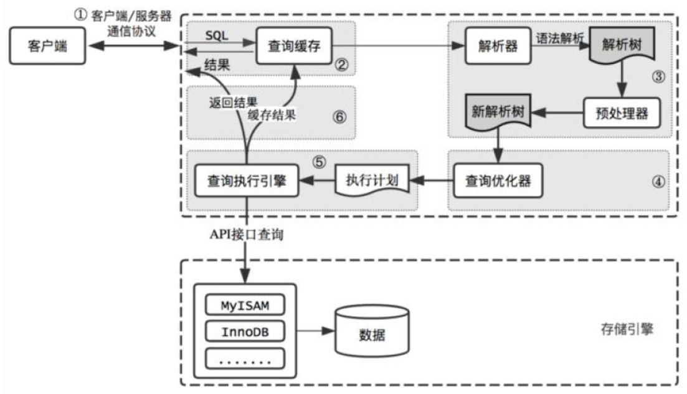

# mysql 数据库调优

标签（空格分隔）： mysql

---

[toc]

## 查询过程

    
    
## 优化方面

1. **安全**，数据可持续性
2. **性能**，数据的高性能访问

## 优化范围

### 存储、主机和操作系统方面

1. 主机架构稳定性
2. I/O规划及配置
3. Swap交换分区
4. OS内核参数和网络问题

### 应用程序方面

1. 应用程序稳定性
2. sql语句性能
3. 串行访问资源
4. 性能欠佳会话管理
5. 应用是否适合mysql

### 数据库方面优化

1. 内存
2. 数据库结构（物理、逻辑）
3. 实例配置

## 优化纬度

1. 硬件
2. 系统配置
3. 数据库表结构
4. SQL及索引

### 优化选择

1. 优化成本：硬件 > 系统配置 > 数据库表结构 > SQL及索引
2. 优化效果：硬件 < 系统配置 < 数据库表结构 < SQL及索引

## 优化工具

### 检查问题常用工具

|名称|说明|
|---|---|
|`msyqladmin`| mysql客⼾端，可进⾏管理操作
|`mysqlshow`| 功能强⼤的查看shell命令
|`show [SESSION \| GLOBAL] variables`| 查看数据库参数信息
|`SHOW [SESSION \| GLOBAL] STATUS`| 查看数据库的状态信息
|`information_schema` |获取元数据的⽅法
|`SHOW ENGINE INNODB STATUS Innodb`|引擎的所有状态
|`SHOW PROCESSLIST` |查看当前所有连接session状态
|`explain` |获取查询语句的执⾏计划
|`show index` |查看表的索引信息
|`slow-log` |记录慢查询语句
|`mysqldumpslow` |分析slowlog⽂件

### 其他工具

|名称|说明|
|---|---|
|`zabbix`| 监控主机、系统、数据库（部署zabbix监控平台）
|`pt-query-digest`| 分析慢⽇志
|`mysqlslap`| 分析慢⽇志
|`sysbench`| 压⼒测试⼯具
|`mysql profiling`| 统计数据库整体状态⼯具
|`Performance Schema`| mysql性能状态统计的数据
|`workbench`| 管理、备份、监控、分析、优化⼯具（⽐较费资源）

## 调优思路

### 应急调优思路

1. `show processlist`
2. 执行如下语句

    ```
    explain select * from 'user'; 
    show index from table;
    ```
3. 通过执行计划判断，索引问题或者语句本身问题
4. 查询锁状态：`show status like '%lock%'；`
5. 杀掉有问题session：`kill SESSION_ID；`

### 常规优化思路

1. 查看slowlog，分析slowlog，分析出查询慢的语句
2. 按照一定优先级，进行一个一个的排查所有慢语句
3. 分析top sql，进行explain调试，查看语句执行时间
4. 调整索引或语句本身

## 数据库优化

- SQL优化方向：执行计划、索引、SQL改写
- 架构优化方向：高可用架构、高性能架构、分库分表

### 数据库参数优化

- 调整实例整体

    ```
    thread_concurrency      # 并发线程数量个数
    sort_buffer_size        # 排序缓存区大小
    read_buffer_size        # 顺序读取缓存区大小
    read_rnd_buffer_size    # 随机读取缓存区大小
    key_buffer_size         # 索引缓存区大小
    table_cache             # 能同时打开表的个数
    thread_cache_size       # (1G—>8, 2G—>16, 3G—>32, >3G—>64)
    ```

- 调整连接层

    ```
    max_connections         # 最大连接数
    max_connect_errors      # 最大错误连接数，能⼤则⼤
    connect_timeout         # 连接超时
    max_user_connections    # 最大用户连接数
    skip-name-resolve       # 跳过域名解析
    wait_timeout            # 等待超时
    ```

- 调整存储引擎层（innodb）

```
default-storage-engine
innodb_buffer_pool_size                     # 没有固定大小，50%测试值，看看情况再微调。设置不要超过物理内存70%
innodb_file_per_table=(1,0)
innodb_flush_log_at_trx_commit=(0,1,2)      # 1是最安全的，0是性能最高，2折中
binlog_sync
Innodb_flush_method=(O_DIRECT, fdatasync)
innodb_log_buffer_size                      # 100M以下
innodb_log_file_size                        # 100M 以下
innodb_log_files_in_group                   # 5个成员以下,⼀般2-3个够用（iblogfile0-N）
innodb_max_dirty_pages_pct                  # 达到75%的时候刷写内存脏页到磁盘。
log_bin
max_binlog_cache_size                       # 可以不设置
max_binlog_size                             # 可以不设置
innodb_additional_mem_pool_size             # 小于2G内存的机器，推荐值是20M。32G内存以上100M
```