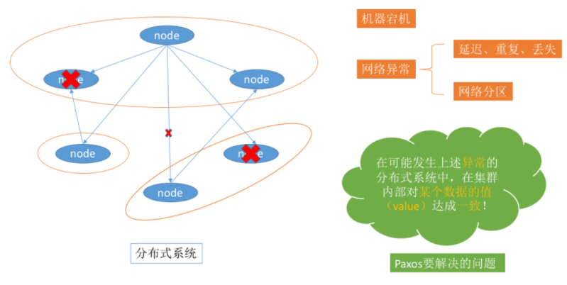
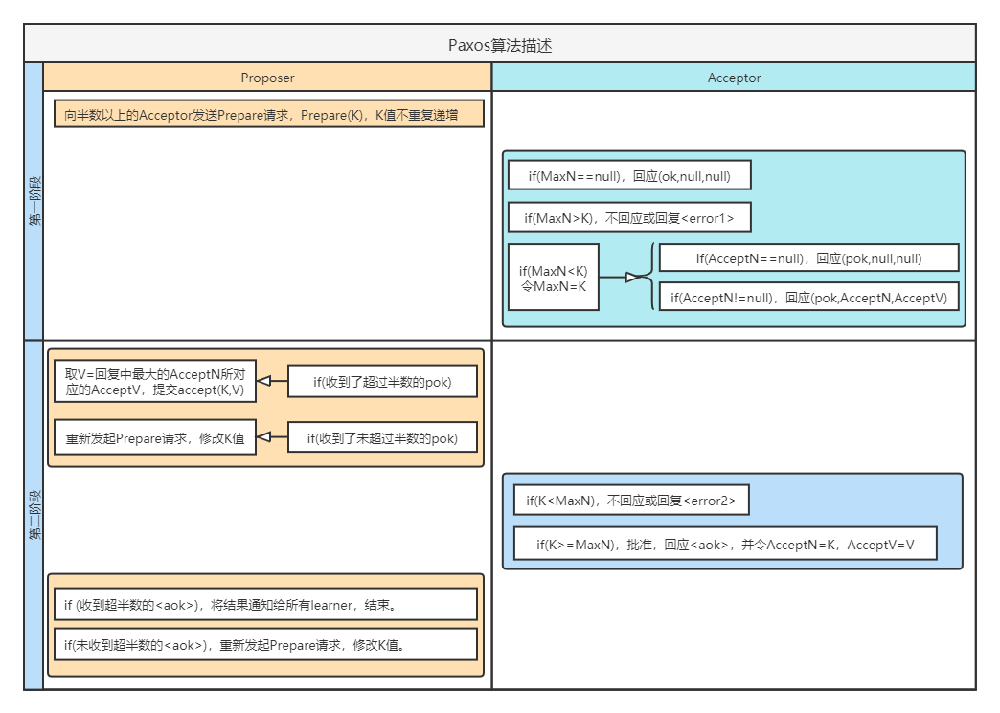

# Paxos 算法

---

[toc]

## 概述

> 一种基于消息传递的一致性算法。
> Paxos算法的前提假设是不存在拜占庭将军问题，即：信道是安全的，发出的信号不会被篡改，因为Paxos算法是基于消息传递的。

### 产生背景

> Paxos 算法是基于消息传递且具有高度容错特性的一致性算法，是目前公认的解决分布式一致性问题最有效的算法之一，其解决的问题就是在分布式系统中如何就某个值（决议）达成一致。

### 拜占庭问题

> 拜占庭帝国军队的将军们必须全体一致的决定是否攻击某一支敌军。问题是这些将军在地理上是分隔开来的，只能依靠通讯员进行传递命令，但是通讯员中存在叛徒，它们可以篡改消息，叛徒可以欺骗某些将军采取进攻行动；促成一个不是所有将军都同意的决定，如当将军们不希望进攻时促成进攻行动；或者迷惑某些将军，使他们无法做出决定。

### 三种角色

> 在具体的实现中，一个进程可能同时充当多种角色。

- `Proposer`，负责提出提案。
- `Acceptor`，负责对提案做出裁决。
- `Learners`，负责学习提案结果。

### 提案处理

> 最终要达成一致的 `value` 就在提案里。
> 只要 `Proposer` 发的提案被 `Acceptor` 接受，`Proposer` 就认为该提案里的 `value` 被选定了。 `Acceptor` 告诉 `Learner` 哪个 `value` 被选定，`Learner` 就认为那个 `value` 被选定。
> 为了避免单点故障，会有一个 `Acceptor` 集合，`Proposer` 向 `Acceptor` 集合发送提案，`Acceptor` 集合中的每个成员都有可能同意该提案且每个 `Acceptor` 只能批准一个提案，只有当一半以上的成员同意了一个提案，就认为该提案被选定了。

### 安全性要求

- 只有被提出的 `value` 才能被选定。
- 只有一个 `value` 被选定，并且如果某个进程认为某个 `value` 被选定了，那么这个 `value` 必须是真的被选定的那个。

### 算法目标

> 保证最终有一个 `value` 会被选定，当 `value` 被选定后，进程最终也能获取到被选定的 `value`。

## 算法描述

> 类似于两阶段提交，其算法执行过程分为两个阶段。阶段一是准备阶段，阶段二是接受阶段。

### 准备阶段（prepare）

1. `Proposer` 选择一个提案编号 `N`，然后向半数以上的 `Acceptor` 发送编号为 `N` 的 `Prepare` 请求。`Pareper（N）`
1. 如果一个 `Acceptor` 收到一个编号为 `N` 的 `Prepare` 请求。
    - 如果没有 `accept` 提案，返回 `{pok，null，null}`
    - 如果 `N` 小于它已经响应过的请求，则拒绝，不回应或回复 `error`。
    - 如果 `N` 大于该 `Acceptor` 已经响应过的所有 `Prepare` 请求的编号（`maxN`），那么它就会将它已经接受过（已经经过第二阶段 `accept` 的提案）的编号最大的提案作为响应反馈给 `Proposer`，同时该 `Acceptor` 承诺不再接受任何编号小于 `N` 的提案。

PS：每一个 `Proposer` 都有可能会产生多个提案。

### 接受阶段（accept）

1. 如果 `Proposer` 没有收到过半的回应，则会重新进入第一阶段，递增提案号，重新提出 `prepare` 请求。
1. 如果 `Proposer` 收到半数以上 `Acceptor` 对其发出的编号为 `N` 的 `Prepare` 请求的响应，则发送一个针对 `[N,V]` 提案的 `Accept` 请求给半数以上的 `Acceptor`。
1. 如果 `Acceptor` 收到一个针对编号为 `N` 的提案的 `Accept` 请求。
    - 如果 `Acceptor` 没有对大于 `N` 的提案做出过响应，则接收该提案。
    - 如果 `Acceptor` 有对大于 `N` 的提案做出过响应，，则拒绝，不回应或回复 `error`。

PS：`V` 就是收到的响应中编号最大的提案的 `value`，如果响应中不包含任何提案，那么`V` 就由 `Proposer` 自己决定。

## `Learner`获取被选定`value`方案

> 位于`accept`阶段。

### 方案一

> `Acceptor` 接受了一个提案，就将该提案发送给所有 `Learner`。

- 优点
    > `Learner` 能快速获取被选定的`value`
- 缺点
    > 通信的次数为`(M*N)`

### 方案二

> `Acceptor` 接受了一个提案，就将该提案发送给 `主Learner`，`主Learner`再通知`其他Learner`。

- 优点
    > 通信次数减少`(M+N-1)`
- 缺点
    > 单点问题，主`Learner`可能出现故障

### 方案三

> `Acceptor` 接受了一个提案，就将该提案发送给一个 `Learner集合`，`Learner集合`再通知`其他Learner`。

- 优点
    > 集合中`Learner`个数越多，可靠性越好
- 缺点
    > 网络通信复杂度越高

## 活锁问题

> 假设有两个 `Proposer` **依次提出**编号递增的议案，最终会陷入**死循环**，没有 `value` 被选定。
> 可通过选取主 `Proposer`，保证Paxos算法的活性，解决活锁问题。
