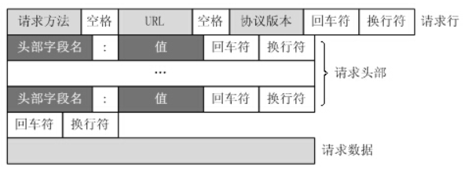
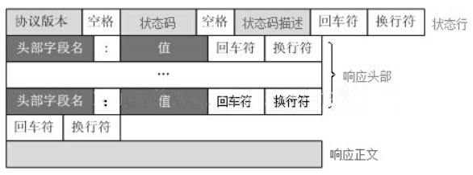

# HTTP 协议介绍

---

[toc]

## 概述

> 超文本传输协议（HTTP，HyperText Transfer Protocol）是一种用于分布式、协作式和超媒体信息系统的应用层协议。

### 请求方法

- `GET`
    > 向指定的资源发出“显示”请求。使用`GET`方法应该只用在读取数据，而不应当被用于产生“副作用”的操作中。

- `POST`
    > 向指定资源提交数据，请求服务器进行处理（例如提交表单或者上传文件）。数据被包含在请求本文中。这个请求可能会创建新的资源或修改现有资源，或二者皆有。

- `PUT`
    > 向指定资源位置上传其最新内容。

- `DELETE`
    > 请求服务器删除`Request-URI`所标识的资源。

- `HEAD`
    > 与`GET`方法一样，都是向服务器发出指定资源的请求。只不过服务器将不传回资源的本文部分。它的好处在于，使用这个方法可以在不必传输全部内容的情况下，就可以获取其中“关于该资源的信息”（元信息或称元数据）。

- `TRACE`
    > 回显服务器收到的请求，主要用于测试或诊断。

- `OPTIONS`
    > 这个方法可使服务器传回该资源所支持的所有HTTP请求方法。用'*'来代替资源名称，向Web服务器发送OPTIONS请求，可以测试服务器功能是否正常运作。

- `CONNECT`
    > `HTTP/1.1` 协议中预留给能够将连接改为管道方式的代理服务器。通常用于SSL加密服务器的链接（经由非加密的HTTP代理服务器）。

### 状态码

|状态码|类型|描述|
|---|---|---|
|`1xx`|消息|请求已被服务器接收，继续处理|
|`2xx`|成功|请求已成功被服务器接收、理解、并接受|
|`3xx`|重定向|需要后续操作才能完成这一请求|
|`4xx`|（客户端）请求错误|请求含有词法错误或者无法被执行|
|`5xx`|服务器错误|服务器在处理某个正确请求时发生错误|

### URL 组成

- 传送协议。
- 层级URL标记符号(为`//`，固定不变)
- 访问资源需要的凭证信息（可省略）
- 服务器。（通常为域名，有时为IP地址）
- 端口号。（以数字方式表示，若为HTTP的默认值`:80`可省略）
- 路径。（以`/`字符区别路径中的每一个目录名称）
- 查询。（GET模式的窗体参数，以`?`字符为起点，每个参数以`&`隔开，再以`=`分开参数名称与数据，通常以UTF8的URL编码，避开字符冲突的问题）
- 片段。以`#`字符为起点

## 工作原理

### 请求/响应步骤

1. 客户端连接到Web服务器
    > 一个HTTP客户端，通常是浏览器，与Web服务器的HTTP端口（默认为80）建立一个TCP套接字连接。
1. 发送HTTP请求
    > 通过TCP套接字，客户端向Web服务器发送一个文本的请求报文，一个请求报文由请求行、请求头部、空行和请求数据4部分组成。
1. 服务器接受请求并返回HTTP响应
    > Web服务器解析请求，定位请求资源。服务器将资源复本写到TCP套接字，由客户端读取。一个响应由状态行、响应头部、空行和响应数据4部分组成。
1. 释放连接TCP连接
    > 若connection 模式为close，则服务器主动关闭TCP连接，客户端被动关闭连接，释放TCP连接;
    > 若connection 模式为keepalive，则该连接会保持一段时间，在该时间内可以继续接收请求;
1. 客户端浏览器解析HTML内容
    > 客户端浏览器首先解析状态行，查看表明请求是否成功的状态代码。
    > 然后解析每一个响应头，响应头告知以下为若干字节的HTML文档和文档的字符集。
    > 客户端浏览器读取响应数据HTML，根据HTML的语法对其进行格式化，并在浏览器窗口中显示。

### 请求协议

### 响应协议

## 工作特点

> HTTP 协议是基于TCP/IP协议之上的应用层协议。

### 基于**请求-响应**的模式

> 请求从客户端发出，最后服务器端响应该请求并返回。

### 无状态保存

> HTTP 是无状态协议，自身不对请求和响应之间的通信状态进行保存。

### 无连接

> 限制每次连接只处理一个请求。
