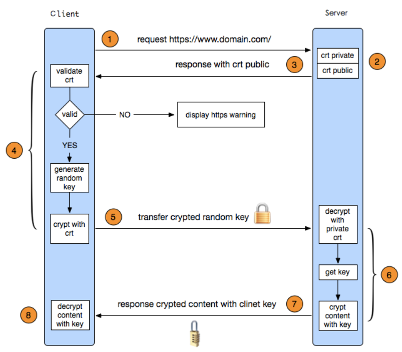

# HTTPS 请求过程

---

[toc]

## 概述

> HTTPS其实是有两部分组成：**`HTTP` + `SSL/TLS`**，也就是在HTTP上又加了一层处理加密信息的模块。
> 服务端和客户端的信息传输都会通过`SSL`/`TLS`进行加密，所以传输的数据都是加密后的数据。

## 请求过程

1. 客户端发起HTTPS请求
1. 服务端的配置
    > 采用HTTPS协议的服务器必须要有一套数字证书（包含一对公钥和私钥），可以自己制作，也可以向组织申请。
1. 传送证书公钥
1. 客户端解析证书
    > 首先会验证公钥是否有效，比如颁发机构，过期时间等等，如果发现异常，则会弹出一个警告框，提示证书存在问题。
    > 如果证书没有问题，那么就生成一个随机值。然后用证书对该随机值进行加密。
1. 传送加密信息
    > 传送用证书加密后的随机值，目的就是让服务端得到这个随机值，以后客户端和服务端的通信就可以通过这个随机值来进行加密解密了。
1. 服务段解密信息
    > 服务端用私钥解密后，得到了客户端传过来的随机值(私钥)，然后把内容通过该值进行**对称加密**。
1. 传输加密后的信息
    > 传送用私钥加密后的信息，可以在客户端被还原。
1. 客户端解密信息
    > 客户端用之前生成的私钥解密服务段传过来的信息，于是获取了解密后的内容。
