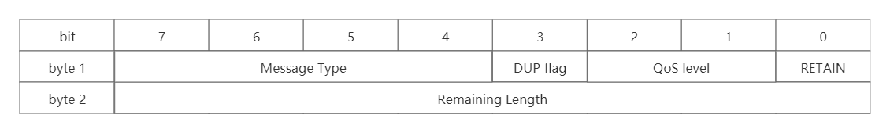

# MQTT 协议介绍

---

[toc]

## 概述

> MQTT 全称(`Message Queue Telemetry Transport`)：一种基于发布/订阅（`publish/subscribe`）模式的轻量级通讯协议，通过订阅相应的主题来获取消息，是物联网（`Internet of Thing`）中的一个标准传输协议。
> 该协议将消息的发布者（`publisher`）与订阅者（`subscriber`）进行分离，因此可以在不可靠的网络环境中，为远程连接的设备提供可靠的消息服务，使用方式与传统的MQ类似。

### 物联网中不使用HTTP原因

- 首先HTTP协议它是一种同步协议，客户端请求后需要等待服务器的响应。而在物联网（IOT）环境中，设备会很受制于环境的影响，比如带宽低、网络延迟高、网络通信不稳定等，显然异步消息协议更为适合IOT应用程序。

- HTTP是单向的，如果要获取消息客户端必须发起连接，而在物联网（IOT）应用程序中，设备或传感器往往都是客户端，这意味着它们无法被动地接收来自网络的命令。

- 通常需要将一条命令或者消息，发送到网络上的所有设备上。HTTP要实现这样的功能不但很困难，而且成本极高。

## 数据包构成

- **固定头（Fixed header）**，所有数据包中都有固定头，包含数据包类型及数据包的分组标识。
- **可变头（Variable header）**，部分数据包类型中有可变头。
- **内容消息体（Payload）**，存在于部分数据包类，是客户端收到的具体消息内容。

### 固定头

> 固定头部，使用两个字节，共16位。

- 消息类型（Message Type）
    |类型名称|类型值|流动方向|报文说明|
    |---|---|---|---|
    |`Reserved`|0|禁止|保留|
    |`CONNECT`|1|服务端 <--- 客户端|发起连接|
    |`CONNACK`|2|服务端 ---> 客户端|连接确认|
    |`PUBLISH`|3|服务端 <--> 客户端|发布消息|
    |`PUBACK`|4|服务端 <--> 客户端|QoS1 消息确认|
    |`PUBREC`|5|服务端 <--> 客户端|QoS2 消息回执（确保交付第一步）|
    |`PUBREL`|6|服务端 <--> 客户端|QoS2 消息释放（确保交付第二步）|
    |`PUBCOMP`|7|服务端 <--> 客户端|QoS2 消息完成（确保交付第三步）|
    |`SUBSCRIBE`|8|服务端 <--- 客户端|订阅请求|
    |`SUBACK`|9|服务端 ---> 客户端|订阅确认|
    |`UNSUBSCRIBE`|10|服务端 <--- 客户端|取消订阅|
    |`UNSUBACK`|11|服务端 ---> 客户端|取消订阅确认|
    |`PINGREQ`|12|服务端 <--- 客户端|心跳请求|
    |`PINGRESP`|13|服务端 ---> 客户端|心跳响应|
    |`DISCONNECT`|14|服务端 <--- 客户端|断开连接|
    |`Reserved`|15|禁止|保留|
- 重试标识（DUP flag）
    > 保证消息可靠传输，消息是否已送达的标识。默认为0，只占用一个字节，表示第一次发送，当值为1时，表示当前消息先前已经被传送过。
- 消息质量等级（QoS Level）
- 持久化（RETAIN）
  - 值为`1`：表示发送的消息需要一直持久保存，而且不受服务器重启影响，不但要发送给当前的订阅者，且以后新加入的客户端订阅了此Topic，订阅者也会马上得到推送。 注意：新加入的订阅者，只会取出最新的一个`RETAIN flag = 1`的消息推送。
  - 值为`0`：仅为当前订阅者推送此消息。
- 剩余长度（Remaining Length）
    > 在当前消息中剩余的byte(字节)数，包含可变头部和消息体payload。

### 可变头

> 可变头部居于固定头部和payload中间，包含了协议名称，版本号，连接标志，用户授权，心跳时间等内容。

可变头存在于这些类型的消息：

- `PUBLISH (QoS > 0)`
- `PUBACK`
- `PUBREC`
- `PUBREL`
- `PUBCOMP`
- `SUBSCRIBE`
- `SUBACK`
- `UNSUBSCRIBE`
- `UNSUBACK`

### 消息体

消息体只存在于以下类型的消息：

- `CONNECT`：包含客户端的 `ClientId`、订阅的 `Topic`、`Message` 以及用户名和密码。
- `PUBLISH`：向对应主题发送消息。
- `SUBSCRIBE`：要订阅的主题以及 `QoS`。
- `SUBACK`：服务器对于 `SUBSCRIBE` 所申请的主题及 `QoS` 进行确认和回复。
- `UNSUBSCRIBE`：取消要订阅的主题。

## [消息质量](MQTT%20QoS%20介绍.md)

> 消息质量（QoS，Quality of Service），有`QoS 0`、`QoS 1`、`QoS 2`三个等级。

## [最后遗嘱](MQTT%20最后遗嘱.md)

> 最后遗嘱（LWT，Last Will and Testament）。

## 应用场景

- 物联网M2M通信，物联网大数据采集
- Android消息推送，WEB消息推送
- 移动即时消息，例如Facebook Messenger
- 智能硬件、智能家具、智能电器
- 车联网通信，电动车站桩采集
- 智慧城市、远程医疗、远程教育
- 电力、石油与能源等行业市场
